# Week 3

## Getting Started with Express

Although you can build full web servers with nothing but Node's built-in 
[http module](https://nodejs.org/api/http.html#http), most codebases will use a framework. 
The API exposed by the http module is pretty minimal and doesn't do a lot of heavy lifting for you.

Building a web application becomes a simpler task with the addition of web frameworks. 
A web framework in Node.js is a module that offers structure to your application that
allows you to build and customize the way your application feels without
worrying about building certain features from scratch, such as serving individual files.

[Express](https://expressjs.com/), is a Node web server framework that promotes itself as "fast, unopinionated, and minimalist". Express can be thought of as an abstraction layer on top of Node's built-in HTTP server.

Express allows you to concentrate on your application's business logic without having to worry too much about web server technicalities such as URL routing, parsing data, setting HTTP headers, and so on.

>Other popular Node web server frameworks include [Nest](https://nestjs.com/), [Koa](https://koajs.com/),
[Socket.io](https://socket.io/), [Fastify](https://www.fastify.io/) and others.

### Create a basic Express server

First we need to initialize a new npm project and install Express. At the command line, run the following commands:

```
npm init
npm i express

```

>Building an Express application can have unique folder structures to store categories of files, so may find other folder/file structures in other resources.

We will create a **src** folder that holds the source code that directly relates to the running of the server. The **app.js** file will hold configuration and **server.js** is where you will run your Express server.

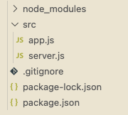

**app.js:**

We want to export the Express instance so that we can use it in our server.js file. 
We will use module.exports to export the Express instance.


```
const express = require("express); 
const app = express(); 

module.exports = app;
```

**server.js:**

This file is responsible for running the server. We will use the app.listen() method to start the server. The code will "listen" on the specified port. The [app.listen()](https://expressjs.com/en/5x/api.html#app.listen_path_callback) method takes two arguments, the port number and a callback function that will be called once the server is listening.

A **port** is a way of having multiple applications listen on the same server. Each application will listen on a different port. The port number is used to identify the application that should handle the request.

```
const { PORT = 8000 } = process.env;
const app = require("./app");

const listener = () => console.log(`Listening on Port ${PORT}!`);
app.listen(PORT, listener);
```

The [process.env](https://nodejs.org/dist/latest-v8.x/docs/api/process.html#process_process_env) object is a global object that stores environment variables.
The PORT variable is set to 8000 if it is not already set. The app variable is set to the Express instance exported from app.js.
The listener variable is a callback function that will be called once the server is listening.

___

**Starting the server:**

At the command line, run the following command:

```
node src/server.js
```

>If you get an Error: listen EADDRINUSE: address already in use :::80000 error, you can change the port number in case of another application is already using port 8000.  


**The nodemon package**

Every time you make a change to one of your files, you will need to re-start your server. 
You can automate this by using the [nodemon](https://www.npmjs.com/package/nodemon) package.

The nodemon package will monitor any file changes and re-start it for you. 

```
npm i nodemon --save-dev
```

To use nodemon, you have to add a script in your "scripts" object in your **package.json** file.

```
"dev": "nodemon src/server.js"
```

You can then run the following command on your command line:

```
npm run dev
```

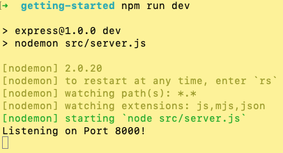


Now, everytime we make a changes to our files, nodemon will restart the server for us. :partying_face:

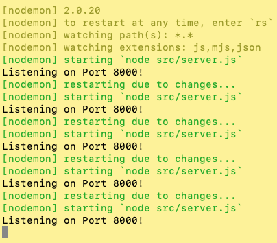

**Stopping the server**

To stop the server, press **Ctrl + C** in your terminal window.

:rotating_light: If you run into an error of: Error: listen EADDRINUSE: address already in use :::8000 :rotating_light:

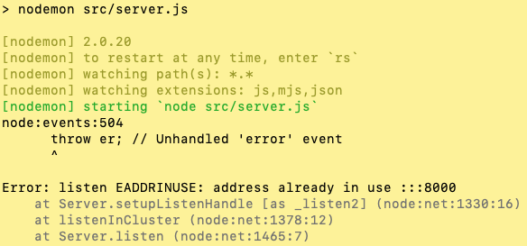

You use use this command to see which process is using the port:

```
lsof -i tcp:8000

```

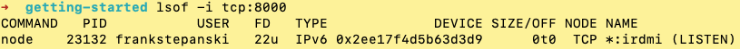


And then run this command to kill the process repalcing the **<PID>** with the process ID number:

```
kill -9 <PID>
```

>Remember, we are on the server now, so we will checking the server's console for errors and troubshooting. :nerd_face:

___


### Routing 

Once the Express server is running and listening for requests, we need to define how the server should 
respond to any given request. 

To tell our Express how to deal with any given request, we register a series of routes. 
Routes define the control flow for requests based on the request's path and HTTP verb.

For example, if your server receives a **GET** request at **/about**, we will use a route to define the appropriate functionality
for that HTTP verb (GET) and path (/about).

The path is the part of a request URL after the hostname and port number, so in a request to localhost:8000/about, 
the path is /about (in this example, the **hostname** is localhost, the port number is 8000).

The HTTP verb is always included in the request, and it is one of a [number of options](https://developer.mozilla.org/en-US/docs/Web/HTTP/Methods) used to specify expected functionality. 
GET requests are used for retrieving resources from a server.

Express uses [app.get()](https://expressjs.com/en/4x/api.html#app.get) to register routes to match GET requests. 
Express routes take up to three arguments, a path (usually a string), a callback function to handle the request and send a response, and a callback argument to the middleware funcvtion, called "next" by convention (optional).

Let's add the following route to app.js: 

```
app.get("/about", (req, res, next) => {
  res.send("About Code the Dream!");
});
```

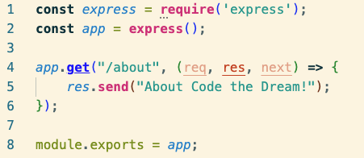

You can test this route by visiting **ttp://localhost:8000/about** in your browser.

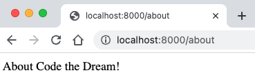

We can also add some HTML to the response:

```
app.get("/about", (req, res, next) => {
  res.send("<h1>About Code the Dream!</h1>");
});
```


> If no routes are matched on a client request, the Express server will handle sending a [404 Not Found response](https://expressjs.com/en/starter/faq.html#how-do-i-handle-404-responses), to the client.  :sob:

**Status Codes**

HTTP status codes are a standard way of communicating the status of a request.

When executed, each operation will return a [status code](https://developer.mozilla.org/en-US/docs/Web/HTTP/Status), indicating whether the invocation has been
successful or not. Successful invocation is indicated by an HTTP 2xx status code, while operations
that are not executed correctly indicate this with erroneous status code — 4xx if the error is
at the client side, or 5xx when the server fails to process a valid request.

>100-199: Informational response; unlikely will return this range\
>200-299: Success; the request was received, understood and processed\
>300-399: Redirection; a resource at a different url was substituted\
>400-499: Client error; problem in how client submitted request\
>500-599: Server error: request accepted, but server error prevented fullfillment

By default, Express will send a [200 status code](https://developer.mozilla.org/en-US/docs/Web/HTTP/Status/200) when a response is sent. 
We can implicitly set the status code by using the [res.status()](https://expressjs.com/en/4x/api.html#res.status) method,
which is a good practice to follow.

```
app.get("/about", (req, res, next) => {
  res.status(200).send("<h1>About Code the Dream!</h1>");
});
```


### Middleware

A web framework like Express.js operates through functions considered to be middleware because they sit between HTTP 
interaction on the web and the Node.js platform. Middleware is a general term applied to code that assists
in listening for, analyzing, filtering, and handling HTTP communication before data interacts with application logic.

>So an Express application is basically a series of middleware function calls.

As we know, the server's job is to receive requests and respond to them. Middleware gets between the request-response cycle and
helps manage the request and can help determine how the server should respond. This can be thought of a 
middleware pipeline where Express puts multiple pieces of middleware together through a series of functions.

These functions have access to the request object (req), the response object (res), and the **next** middleware
function in the application's request-response cycle. The next middleware function is commonly denoted by a variable named next.

Middleware functions can perform the following tasks:
  - Execute any code.
  - Make changes to the request and the response objects.
  - End the request-response cycle.
  - Call the **next** middleware function in the stack.

Types of Middleware:
  - Application-level middleware
  - Router-level middleware
  - Error-handling middleware
  - Built-in middleware

If you write your own middleware, it will have this signature:

```
const middleware = (req, res, next) => {
  // Middleware function body
}
```

  - **req** parameter stands for request; object stores the information and methods from the incoming request.
  - **res** parameter stands for response; object stores the information and methods related to sending a response back to the client. 
  - **next** parameter, when called, tells Express that this middleware function is complete and goes to the next piece of middleware.

 Middleware functions are callback functions. Express uses the **use()** method to register middleware functions and 
calls them in the order they are registered.

>Using the **next()** will execute the code after the current middleware function is finished. 
Using **return next()** will immediately jump out of the callback the code below will be unreachable.

**Third-party Middleware**

Third-party middleware (aka Application-level) is middleware that is not built into Express, 
but available as a separate Node.js module that can be installed using npm. 

A few of the commonly used middleware packages that we will be using in this course are:

  - [body-parser](https://www.npmjs.com/package/body-parser): provides parsing for HTTP request bodies; parsing both URL-encoded and JSON-encoded bodies, as well as others.
  - [morgan](https://www.npmjs.com/package/morgan): provides HTTP request logging; logs HTTP requests to the console.
  - [helmet](https://www.npmjs.com/package/helmet): security middleware functions that set HTTP response headers to help protect your app from some well-known web vulnerabilities.
  - [static](https://expressjs.com/en/starter/static-files.html): serves static files such as images, CSS files, and JavaScript files.

**Using Middleware**

To test out a middleware function, we can create a simple one that logs the request method and the request path to the console.

```
const logRequest = (req, res, next) => {
  console.log("A request is being made!");
  next();
};
```

We can then register this middleware function with the **use()** method in app.js

```app.use(logRequest);```

Visiting http://localhost:8000/about in your browser will now log the message to the console.

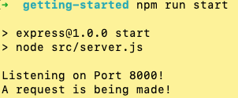

Not very exciting, but it's a start. :thumbsup:

Let's implement the third party logging middleware [Morgan](https://www.npmjs.com/package/morgan).
First, require morgan at the top of your app.js file, right after the other requires.

```
const morgan = require("morgan");
```

Then register the middleware with the use() method.

```
app.use(morgan("dev"));
```

Now, we will get a more detailed log of the request in the console (you will see lots useful stuff later).  :wink:

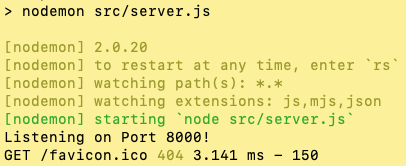

___

### Route Parameters

Routes become more powerful when they can be used dynamically. 

Express provides this with 
[route parameters](https://expressjs.com/en/guide/routing.html#route-parameters). Parameters are route path segments 
that begin with **:** in their Express route definitions. They act as wildcards, matching any text at that path segment. 

For example /todos/:id will match both **/todos/1** and **/todos/7**.

Express parses the parameters, extracts the value, and attaches them as an object to the request object: [req.params](https://expressjs.com/en/api.html#req.params). 
This object's keys are any parameter names in the route, and each key's value is the actual value of 
that field per request.

```
const cars = { 
  honda: { model: "Accord", price: 30000 }, 
  lexus: { model: "LX", age: 90000 } 
};

// GET /cars/lexus
app.get('/cars/:name', (req, res, next) => {
  console.log(req.params); // { name: 'lexus' }
  res.send(cars[req.params.name]);
});
```

In the above code, a .get() route is defined to match the **/cars/:name** path. When a GET request arrives for **/cars/lexus**, 
the callback is called. Inside the callback, req.params will be an object containing the key name and the value lexus, 
which was present in the actual request path.

The appropriate car is retrieved by name (the object key) from the cars object and sent back to the client with res.send().

So now if we visit **ttp://localhost:8000/cars/lexus** in our browser, we will see the following:


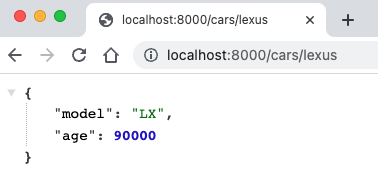

And in our terminal:


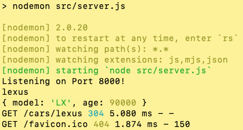


Express also provides query parameters. Query parameters are used to send additional information to the server.


### Query Strings


## Static Serving


## JSON


## Query Params


## Middleware  - Body Parsing


## app.get app.post


### Deployment


