# Week 3

## Getting Started with Express

Although you can build full web servers with nothing but Node's built-in 
[http module](https://nodejs.org/api/http.html#http), most codebases will use a framework. 
The API exposed by the http module is pretty minimal and doesn't do a lot of heavy lifting for you.

Building a web application becomes a simpler task with the addition of web frameworks. 
A web framework in Node.js is a module that offers structure to your application that
allows you to build and customize the way your application feels without
worrying about building certain features from scratch, such as serving individual files.

[Express](https://expressjs.com/), is a Node web server framework that promotes itself as "fast, unopinionated, and minimalist". Express can be thought of as an abstraction layer on top of Node's built-in HTTP server.

Express allows you to concentrate on your application's business logic without having to worry too much about web server technicalities such as URL routing, parsing data, setting HTTP headers, and so on.

>Other popular Node web server frameworks include [Nest](https://nestjs.com/), [Koa](https://koajs.com/),
[Socket.io](https://socket.io/), [Fastify](https://www.fastify.io/) and others.

### Create a basic Express server

First we need to initialize a new npm project and install Express. At the command line, run the following commands:

```
npm init
npm i express

```

>Building an Express application can have unique folder structures to store categories of files, so may find other folder/file structures in other resources.

We will create a **src** folder that holds the source code that directly relates to the running of the server. The **app.js** file will hold configuration and **server.js** is where you will run your Express server.


**app.js:**

We want to export our [app](https://expressjs.com/en/5x/api.html#app) so that we can use it in our server.js file.
```
const express = require("express"); 
const app = express(); 

module.exports = app;
```

**server.js:**

This file is responsible for running the server. We will use the app.listen() method to start the server. The code will "listen" on the specified port. The [app.listen()](https://expressjs.com/en/5x/api.html#app.listen_path_callback) method takes two arguments, the port number and a callback function that will be called once the server is listening.

A **port** is a way of having multiple applications listen on the same server. Each application will listen on a different port. The port number is used to identify the application that should handle the request.

```
const { PORT = 8000 } = process.env;
const app = require("./app");

const listener = () => console.log(`Listening on Port ${PORT}!`);
app.listen(PORT, listener);
```

The [process.env](https://nodejs.org/dist/latest-v8.x/docs/api/process.html#process_process_env) object is a global object that stores environment variables.
The PORT variable is set to 8000 if it is not already set. The app variable is set to the Express instance exported from app.js.
The listener variable is a callback function that will be called once the server is listening.

___

**Starting the server:**

At the command line, run the following command:

```
node src/server.js
```

>If you get an Error: listen EADDRINUSE: address already in use :::80000 error, you can change the port number in case of another application is already using port 8000.  


**The nodemon package**

Every time you make a change to one of your files, you will need to re-start your server. 
You can automate this by using the [nodemon](https://www.npmjs.com/package/nodemon) package.

The nodemon package will monitor any file changes and re-start it for you. 

```
npm i nodemon --save-dev
```

To use nodemon, you have to add a script in your "scripts" object in your **package.json** file.

```
"dev": "nodemon src/server.js"
```

You can then run the following command on your command line:

```
npm run dev
```


Now, everytime we make a changes to our files, nodemon will restart the server for us. :partying_face:


**Stopping the server**

To stop the server, press **Ctrl + C** in your terminal window.

:rotating_light: If you run into an error of: Error: listen EADDRINUSE: address already in use :::8000 :rotating_light:


You use use this command to find which process is using the port: :eyes:

```
lsof -i tcp:8000

```


And then run this command to kill the process replacing the **<PID>** with the process ID number:

```
kill -9 <PID>
```

>Remember, we are on the server now, so we will be referencing the terminal more to help us troubshoot errors. :nerd_face:

___

### Routing 

Once the Express server is running and listening for requests, we need to define how the server should 
respond to any given request. 

To tell our Express server how to deal with any given request, we register a series of routes. 
Routes define the control flow for requests based on the request's path and HTTP verb.

For example, if your Express server receives a **GET** request at **/about**, we will use a route to define the appropriate functionality
for that HTTP verb (GET) and path (/about).

The path is the part of a request URL after the hostname and port number, so in a request to localhost:8000/about, 
the path is /about (in this example, the **hostname** is localhost, the port number is 8000).

The HTTP verb is always included in the request, and it is one of a [number of options](https://developer.mozilla.org/en-US/docs/Web/HTTP/Methods) used to specify expected functionality. 
GET requests are used for retrieving resources from a server.

Express uses [app.get()](https://expressjs.com/en/4x/api.html#app.get) to register routes to match GET requests. 
Express routes take up to three arguments, a path (usually a string), a callback function to handle the request and send a response, and a callback argument to the middleware funcvtion, called "next" by convention (optional).

Let's add the following route to app.js: 

```
app.get("/about", (req, res, next) => {
  res.send("About Code the Dream!");
});
```


You can test this route by visiting **localhost:8000/about** in your browser.


We can also add some HTML to the response:

```
app.get("/about", (req, res, next) => {
  res.send("<h1>About Code the Dream!</h1>");
});
```


**Headers and Browser Dev Tools**

Web requests are more complicated than just the URL. Both the request and response can have additional data to be sent back and forth, 
and this process is invisible to most users. This metadata is generally referred to as [headers](https://developer.mozilla.org/en-US/docs/Web/HTTP/Headers).

You can use the browser's developer tools to view the response from the server:

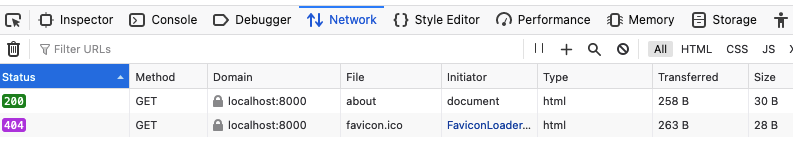

If you click on the **about** stream you will see details about the header server response:

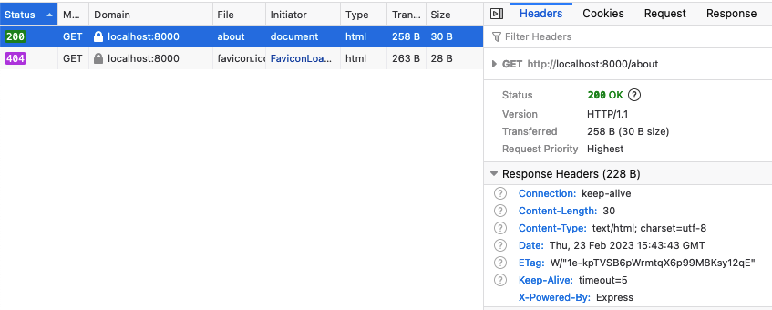

Then you can click on the Response tab you will see the data that was sent back to the browser:

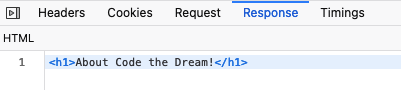

There are other tools you can use to view the headers (and much, much more), such as [Postman](https://www.postman.com/). Next Week! :zany_face:

>The 404 Status on the **favicon.ico** is normal. The browser is trying to load the favicon.ico file from the root of the server.

**404 Error Handler** :broken_heart:

If no routes are matched on a client request, the Express server will send a [404 Not Found response](https://expressjs.com/en/starter/faq.html#how-do-i-handle-404-responses), to the client.

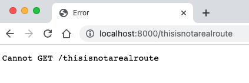

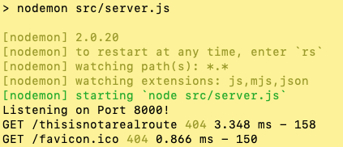

> How can we make this better? :thinking:

We can add a catch-all route to handle any requests that are not matched by a route.

A 404 error handler can be thought of as a route handler defined **after all of the others** without a path associated with it. 
Though this type of route is normally used with [app.use()](https://expressjs.com/en/5x/api.html#app.use) instead of [app.get()](https://expressjs.com/en/5x/api.html#app.get) since there is no specific route you are trying to match.

**Note:** You could use app.get() and just use `*` as the path, but this is not recommended.

```
app.use((req, res, next) => {
  res.status(404).send("<h1>404: Page not found</h1>");
});
```

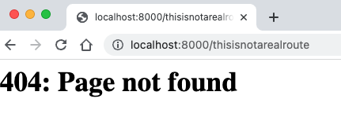

>**Order of routes** - The order of routes is important.  Express searches through routes in the order that they are registered in your code.
The first one that is matched will be used, and its callback will be called.

**Status Codes**

HTTP status codes are a standard way of communicating the status of a request.

When executed, each operation will return a [status code](https://developer.mozilla.org/en-US/docs/Web/HTTP/Status), indicating whether the invocation has been
successful or not. Successful invocation is indicated by an HTTP 2xx status code, while operations
that are not executed correctly indicate this with erroneous status code — 4xx if the error is
at the client side, or 5xx when the server fails to process a valid request.

>100-199: Informational response; unlikely will return this range\
>200-299: Success; the request was received, understood and processed\
>300-399: Redirection; a resource at a different url was substituted\
>400-499: Client error; problem in how client submitted request\
>500-599: Server error: request accepted, but server error prevented fullfillment

By default, Express will send a [200 status code](https://developer.mozilla.org/en-US/docs/Web/HTTP/Status/200) when a response is sent. 
We can implicitly set the status code by using the [res.status()](https://expressjs.com/en/4x/api.html#res.status) method,
which is a good practice to follow.

```
app.get("/about", (req, res, next) => {
  res.status(200).send("<h1>About Code the Dream!</h1>");
});
```

___

### Middleware

A web framework like Express.js operates through functions called [middleware](https://expressjs.com/en/guide/using-middleware.html) that sit between 
an HTTP interaction on the web and the Node.js platform. Middleware is a general term applied to code that assists in listening for, analyzing, filtering, and handling HTTP communication
before data interacts with application logic. That is, middleware is code that runs between the request and the response. 

>So an Express application is basically a series of middleware function calls. :white_check_mark:

Middleware gets between the [request-response cycle](https://developer.mozilla.org/en-US/docs/Web/HTTP/Overview) and helps manage the request and can help determine how the server should respond. 
This can be thought of as a middleware pipeline where Express puts multiple pieces of middleware together through a series of functions.

These functions have access to the request object (**req**), the response object (**res**), and the **next** middleware
function in the application's request-response cycle. The next middleware function is commonly denoted by a variable named next.

Middleware functions can perform the following tasks:
  - Execute any code.
  - Make changes to the request and the response objects.
  - End the request-response cycle.
  - Call the **next** middleware function in the stack.

Types of Middleware:
  - Application-level middleware
  - Router-level middleware
  - Error-handling middleware
  - Built-in middleware

If you write your own middleware, it will have this signature:

```
const middleware = (req, res, next) => {
  // Middleware function body
}
```

  - **req** parameter stands for request; object stores the information and methods from the incoming request.
  - **res** parameter stands for response; object stores the information and methods related to sending a response back to the client. 
  - **next** parameter, when called, tells Express that this middleware function is complete and goes to the next piece of middleware.

 Middleware functions are callback functions. Express uses the **use()** method to register middleware functions and 
calls them in the order they are registered.

>Using **next()** will execute the code after the current middleware function is finished. 
Using **return next()** will immediately jump out of the callback the code below will be unreachable.

**Third-party Middleware**

Third-party middleware (aka Application-level) is middleware that is not built into Express, 
but available as a separate Node.js module that can be installed using npm. 

A few of the commonly used middleware packages that we will be using in this course are:

  - [body-parser](https://www.npmjs.com/package/body-parser): provides parsing for HTTP request bodies; parsing both URL-encoded and JSON-encoded bodies, as well as others.
  - [morgan](https://www.npmjs.com/package/morgan): provides HTTP request logging; logs HTTP requests to the console.
  - [helmet](https://www.npmjs.com/package/helmet): security middleware functions that set HTTP response headers to help protect your app from some well-known web vulnerabilities.
  - [static](https://expressjs.com/en/starter/static-files.html): serves static files such as images, CSS files, and JavaScript files.

**Using Middleware**

To test out a middleware function, we can create a simple one that logs the request method and the request path to the console.

```
const logRequest = (req, res, next) => {
  console.log("A request is being made!");
  next();
};
```

We can then register this middleware function with the [.use()](https://expressjs.com/en/5x/api.html#app.use) method of the [app](https://expressjs.com/en/5x/api.html#app) object.

```app.use(logRequest);```

Now, visiting **localhost:8000/about** in your browser will now log the message to the console.


Not very exciting, but it's a start. :thumbsup:

Let's implement the third party logging middleware [Morgan](https://www.npmjs.com/package/morgan).\
First we require it at the top of the app.js file, right after the other requires:

```
const morgan = require("morgan");
```

Then we register the middleware with the use() method:

```
app.use(morgan("dev"));
```

Now, we will get a more detailed log of the request in the console (you will see lots more useful stuff later).  :wink:


___

### Route Parameters

Routes become more powerful when they can be used dynamically. 

Express provides this with 
[route parameters](https://expressjs.com/en/guide/routing.html#route-parameters). Parameters are route path segments 
that begin with **:** in their Express route definitions. They act as wildcards, matching any text at that path segment. 

For example **/todos/:id** will match both **/todos/1** and **/todos/7**.

Express parses the parameters, extracts the value, and attaches them as an object to the request object: [req.params](https://expressjs.com/en/api.html#req.params). 
This object's keys are any parameter names in the route, and each key's value is the actual value of 
that field per request.

```
const cars = { 
  honda: { model: "Accord", price: 30000 }, 
  lexus: { model: "LX", age: 90000 } 
};

// GET /cars/lexus
app.get('/cars/:name', (req, res, next) => {
  console.log(req.params.name); // lexus
  console.log(cars[req.params.name]); // { model: 'LX', age: 90000 }
  res.send(cars[req.params.name]);
});
```

In the above code, a [.get()](https://expressjs.com/en/5x/api.html#app.get) route is defined to match the **/cars/:name** path. When a GET request arrives for **/cars/lexus**, 
the callback is called. Inside the callback, req.params will be an object containing the key name and the value lexus, 
which was present in the actual request path.

The appropriate car is retrieved by name (the object key) from the cars object and sent back to the client with [res.send()](https://expressjs.com/en/5x/api.html#res.send).

So now if we visit **localhost:8000/cars/lexus** in our browser, we will see the following:


And in our terminal:


___

### Query Parameters

A [query string](https://en.wikipedia.org/wiki/Query_string) is text that comes at the end of a URL following a question mark **?**. 
It provides additional information to a given route. 

A query parameter is a key-value pair in a query string. The key and the value are strings separated by an equals sign =. 

```
// GET /search?q=javascript
app.get('/search', (req, res, next) => {
  console.log(req.query.q); // javascript
  res.send(`You searched for: ${req.query.q}`);
});
```

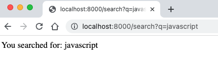

In the above example, the query parameter key is **q** and the value is **javascript**. We can access these query parameters by
using the [req.query](https://expressjs.com/en/api.html#req.query) object. The contents of URL query strings are
stored in an object called **req.query**. This object will be empty if there are no parameters, otherwise it will be 
an object of key value pairs.

___

### Putting Route and Query Parameters Together

We can use the query and route paramters together to create a more dynamic route. 
This is useful when we want to filter the data we are retrieving from a database.

The following route will match **/cars/lexus?color=red**. 
The route parameter **name** will be lexus, and the query parameter **color** will be red.
 
```
// GET /cars/lexus?color=red
app.get('/cars/:name', (req, res, next) => {
  console.log(req.params.name); // lexus
  console.log(req.query.color); // red
  console.log(cars[req.params.name]); // { model: 'LX', age: 90000 }
  res.send(cars[req.params.name]);
});
```

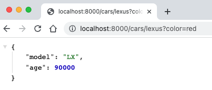

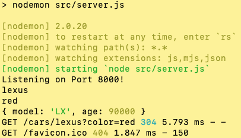

>But which is better? Route or Query parameters? (The answer is it depends.) :smiling_imp:

Route parameters are used to identify a resource, while query parameters are used to filter the results of a query.
Meaning, you can use query parameters to get a subset of the data from a resource.

___

### Serving Static files

Most web applications contain static files that return the same response to all users. These could include images, favicons, CSS stylesheets, client-side JavaScript, pre-rendered HTML pages, or any other asset.
Express allows you to define a **single directory** that contains **static assets** and returns any file that matches the URL path.

You would use the [static method](https://expressjs.com/en/starter/static-files.html) from the [express](https://expressjs.com/en/5x/api.html#express) module. 
This method takes an absolute path to the folder containing your static files.

>Yes, more middleware!!! :partying_face:

As with any other middleware function, you need to tell the Express app instance to use this feature. 
  
  - Add a **public** folder in your root project folder

  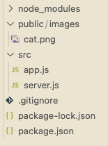

  - Find a **cute** cat image and create an **images** folder inside the public folder
 
  - Add the following code to the app.js file (before route definitions):

  ```
  app.use(express.static("public"))
  ``` 
Then visit **localhost:8000/images/cat.jpg** in your browser. You should see the cat image. :heart_eyes_cat:


>**Note:** The **public** folder is a convention. 

___

### JSON

For REST APIs to be useful, they need to work with data in a format that is **easy** to consume. This is where [JSON](https://www.json.org/json-en.html) comes in.

JSON (JavaScript Object Notation) is a common format for storing and transmitting data over the internet. It is based on a subset of the JavaScript Programming Language, 
more specifically the [JavaScript object literal](https://developer.mozilla.org/en-US/docs/Web/JavaScript/Guide/Working_with_Objects#objects_and_properties).

It is easy for humans to read and write to this format as well as easy for machines to parse and generate. We all like easy, right? 
Just like the [song](https://www.youtube.com/watch?v=0XRrYgByp28) says, "It's easy like Sunday morning". :sunglasses:

**Serialization and Deserialization**

The process of sending data in JSON format to a REST API is called **serialization**. 

>Serialization is the process of converting an object into a stream of bytes to store the object or transmit it to memory.

To do this in JavaScript we can use the [JSON.stringify()](https://developer.mozilla.org/en-US/docs/Web/JavaScript/Reference/Global_Objects/JSON/stringify) method.

```
const car = {
  model: 'LX',
  age: 90000
};

const json = JSON.stringify(car);
```

The process of parsing received JSON data from a REST API is called **deserialization**.

>Deserialization is the reverse process where the byte stream is used to recreate the actual JavaScript object in memory. 

To do this in JavaScript we can use the [JSON.parse()](https://developer.mozilla.org/en-US/docs/Web/JavaScript/Reference/Global_Objects/JSON/parse) method.

```
const json = '{"model":"LX","age":90000}'; // this would be coming from a REST API
const car = JSON.parse(json);
```

**Serving JSON**

The state of an application is all the data that the application must keep track of in order to work.
This data is usually stored in a database, but for small applications, and for our immediate purpose, it can be stored in a JSON file.

We will create a **data** folder and store a .json file in it. 

To make it easy, let's grab some JSON data from the popular [JSONPlaceholder](https://jsonplaceholder.typicode.com/) API. 
Head over to their website and click on the [Users](https://jsonplaceholder.typicode.com/users) link and save that page as a JSON file in the **data** folder
you just created.

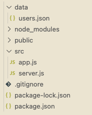

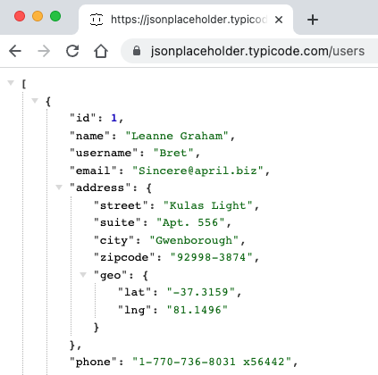

Now we can import this data into our app.js file and use it in our routes.

```
const users = require('./data/users.json');

  // ... other middleware and routes

app.get('/users', (req, res, next) => {
  res.send(users);
});
```

Then visit **localhost:8000/users** in your browser. You should see the JSON data.

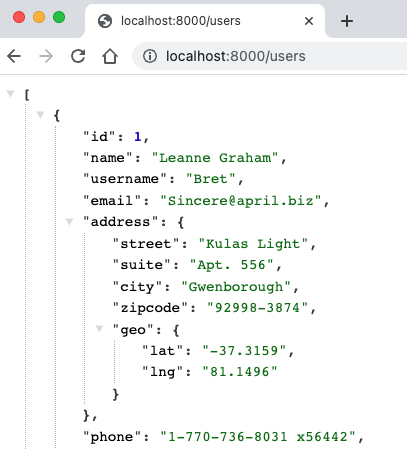

If we look in our browser's dev tools, we can see that the **Content-Type** is **application/json**. We didn't set this, it was set automatically by Express.
Using the [res.send()](https://expressjs.com/en/api.html#res.send) method, Express will automatically set the **Content-Type** header based on the data type of the argument.

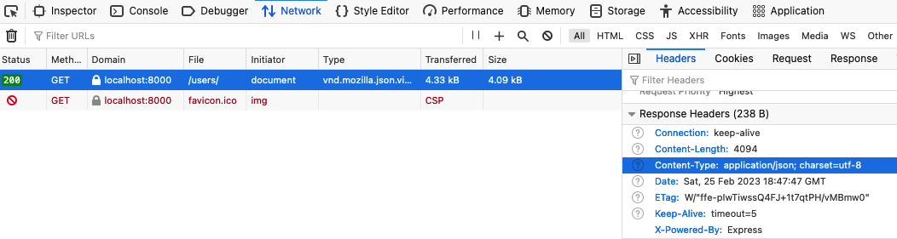

Great, we displayed all of our users, but what if we want just one particular user? 

We can use the **id** property to get a specific user by passing it as a **route parameter**. :cowboy_hat_face:

```
app.get('/users/:id', (req, res, next) => {
  const user = users.find(user => user.id === parseInt(req.params.id));
  res.send(user);
});
```

Then visit **localhost:8000/users/5** in your browser. You should see the JSON data for the user with the id of 5.

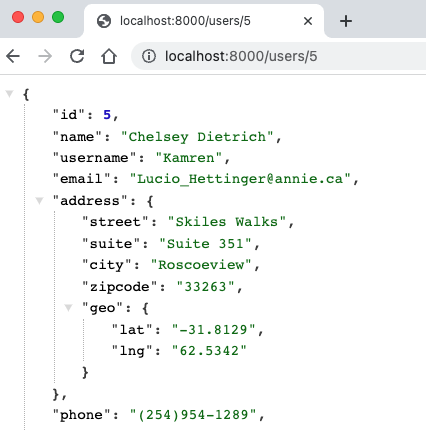

**res.json()**

In the previous example, we used the [res.send()](https://expressjs.com/en/api.html#res.send) method to send the JSON data to the browser.
But what if we want to send a JSON response that was created from a JavaScript object? hmmmm...

We can use the [res.json()](https://expressjs.com/en/api.html#res.json) method to send a JSON response.

```
app.get('/users/:id', (req, res, next) => {
  const user = users.find(user => user.id === parseInt(req.params.id));
  res.json(user);
});
```


**JSON Browser Extensions**

Although we can view JSON in the browser, it is not very readable.  To make it easier to read, we can install a browser extension that will format the JSON for us.
There are many extensions that do this, a very popular one for the Chrome browser is [JSON Formatter](https://chrome.google.com/webstore/detail/json-formatter/bcjindcccaagfpapjjmafapmmgkkhgoa?hl=en).

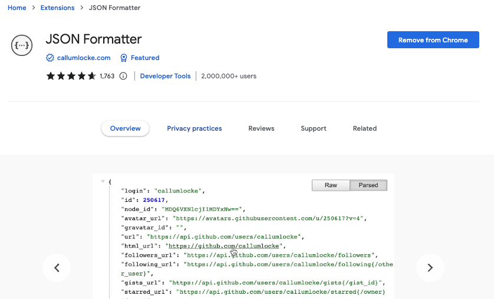

>As mentioned earlier, we will talk about another tool to interact with APIs and JSON next week. So stay tuned! :wink:


___

### Deployment

...

