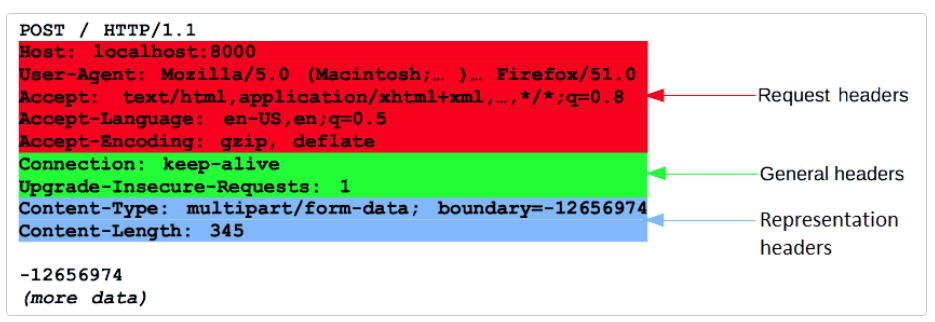
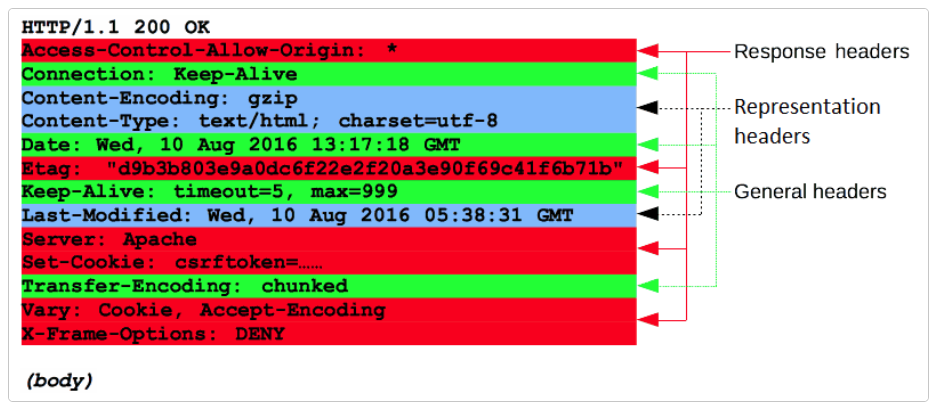

# Week 4

##  HTTP Request/Response Object, Postman, CRUD HTTP Requests and MVC

Before we get our hands dirty on other types of HTTP requests, let's review the HTTP Request and Response objects of an [HTTP flow](https://developer.mozilla.org/en-US/docs/Web/HTTP/Overview#http_flow).

### HTTP Request Object

When an end user navigates to a URL, the browser automatically generates an [HTTP request](https://developer.mozilla.org/en-US/docs/Web/HTTP/Messages#http_requests) for a resource. 

The first line of the request is the [request line](https://developer.mozilla.org/en-US/docs/Web/HTTP/Messages#start_line) which contains three parts: the request method, the request URI, and the HTTP version.
  - The request method: tells the server what kind of request is being made.
  - The request URI: tells the server what resource is being requested.
  - The HTTP version: tells the server what version of HTTP is being used.

The rest of the HTTP Request:

 - headers: additional information about the request.
 - empty line: separates the headers from the body. 
 - body: the data that is being sent to the server (optional).



### HTTP Response Object

After a web server receives an HTTP request, it will process and send an [HTTP reponse](https://developer.mozilla.org/en-US/docs/Web/HTTP/Messages#http_responses) to the client. 

 - protocol version in use, the status code and status message. 
 - headers: instructions for handling the response and security requirements. 
 - body: data that is being sent to the client (optional). 



### Other HTTP Methods

In addition to GET, there are other HTTP methods that we can use to interact with resources on a server.

  - [POST](https://developer.mozilla.org/en-US/docs/Web/HTTP/Methods/POST): creates a new resource
  - [PUT](https://developer.mozilla.org/en-US/docs/Web/HTTP/Methods/PUT): update an existing resource
  - [DELETE](https://developer.mozilla.org/en-US/docs/Web/HTTP/Methods/DELETE): delete an existing resource


Instead reading paragraphs and paragraphs of explanation, let's do a quick Q & A.

**What is a resource?**

A resource is an object or representation of something. For example, a todo is a resource. A todo can have an id, a desciprtion and a completed property (among other things). 
These are all properties of the todo resource. 

**How do I access a resource?**

We can use a route to access a resource. A route is a path that we can use to access a resource.

**How does a route specify what to do with a resource?**

We use an HTTP method to specify what to do with a resource, such as GET, POST, PUT, and DELETE.
An HTTP method combined with a route specifies what to do with a resource.
This is called an endpoint.

**So, what is an endpoint exactly?**

An endpoint is a combination of an HTTP method and a route. An endpoint specifies what to do with a resource.

**What is the difference between a route and an endpoint?**

A route is a path that we can use to access a resource. An endpoint is a combination of an HTTP method and a route. An endpoint specifies what to do with a resource.

**How does a route know which resource to access?**

We can use a route parameter to tell the server which resource to access. A route parameter is a variable that we can use to access a resource.

**How do we know which HTTP method to use?**

We can use the following table to help us decide which HTTP method to use.

**How do we know which HTTP method to use?**
We can use the following table to help us decide which HTTP method to use.

| HTTP Method | CRUD Operation | Description                 |
| ----------- | -------------- | --------------------------- |
| GET         | Read           | Retrieve a resource         |
| POST        | Create         | Create a new resource       |
| PUT         | Update         | Update an existing resource |
| DELETE      | Delete         | Delete an existing resource |


**Some examples:**

```
// todos resource

const todos = [
  {
    id: 1,
    description: 'Learn Express',
    completed: false
  },
  {
    id: 2,
    description: 'Learn React',
    completed: false
  },
  {
    id: 3,
    description: 'Learn Redux',
    completed: false
  },
  {
    id: 4,
    description: 'Learn Node',
    completed: false
  }
]

// API endpoints:

`GET /todos` => returns all todos
`GET /todos/1` => returns todo with id 1

`POST /todos` => creates a new todo
`POST /todos/1` => creates a new todo with id 1

`PUT /todos` => updates all todos
`PUT /todos/1` => updates todo with id 1

`DELETE /todos` => deletes all todos
`DELETE /todos/1` => deletes todo with id 1

```