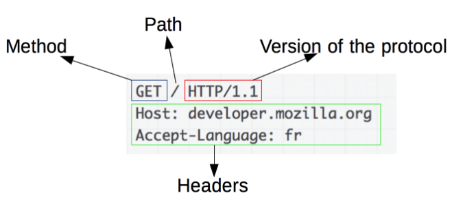
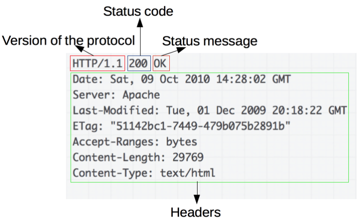

# Week 4

## Request/Response Cycle, REST Methods, Postman and MVC

### Request and Response Cycle

To delve a little deeper into the process of how APIs work, let's look at the [request and response](https://developer.mozilla.org/en-US/docs/Web/HTTP/Overview#http_flow) cycle.

**HTTP Request**

A HTTP request is made up of a few parts:
  - The HTTP method - GET, POST, PUT, DELETE
  - The URL
  - The HTTP version 
  - The request headers
  - The request body 

  

**HTTP Response**

A HTTP response is made up of a few parts:
  - The HTTP version
  - The status code
  - The status message
  - The response headers
  - The response body

  

### Postman

Postman is a tool that allows you to test your API endpoints. It is a great tool to use when you are developing your API. 
It allows you to test your endpoints and see the responses that you get back. It also allows you to test different HTTP methods and see how your API responds to them.

