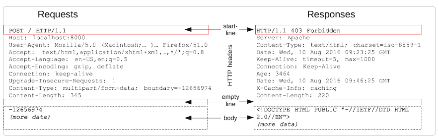
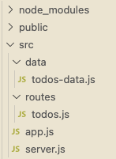
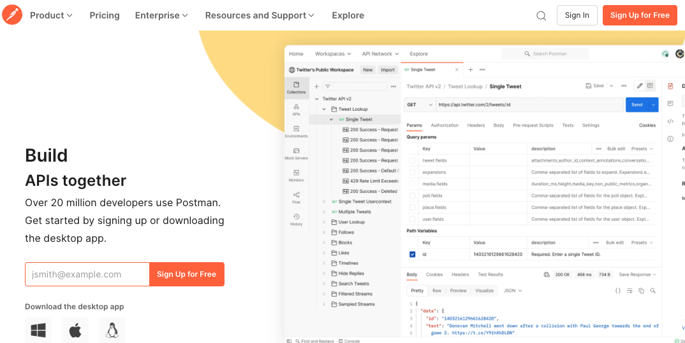
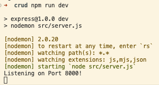
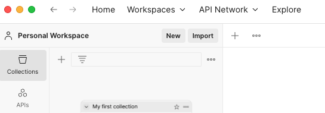
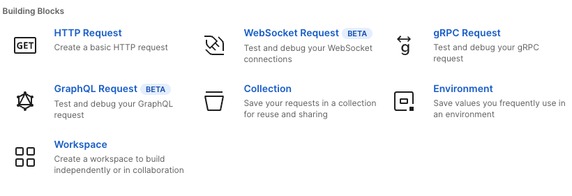
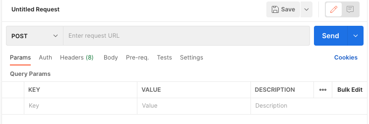
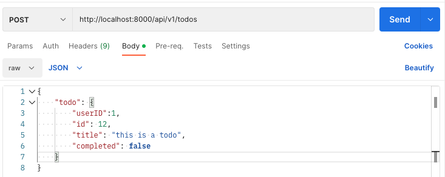
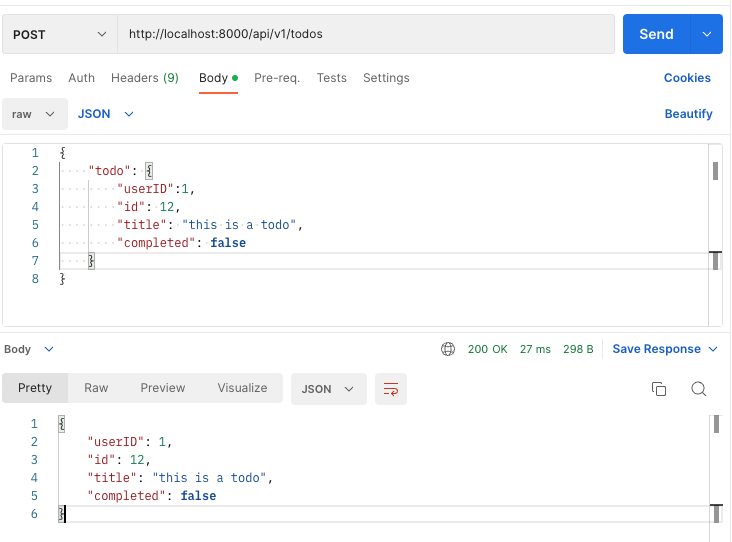

# Week 4

## Table of Contents
  - link 1
  - link 2
  - link 3
  - link 4

## Objectives
- RESTful APIs
- CRUD HTTP Requests
- Using Postman
- Error handling
- MVC
- Controllers
- Routers

## Representational state transfer (REST)

When a web API follows the [constraints of REST](https://restfulapi.net/rest-architectural-constraints/), the API called a RESTful API. :sleeping:

A RESTful API is all about URLs, which provide access to resources such as HTML, CSS, image, JSON, that are returned by a request.

There are [design principles](https://apiguide.readthedocs.io/en/latest/build_and_publish/use_RESTful_urls.html) that each RESTful API usually follows: 

A few of the most important principles are:
  - Use nouns to identify resources (e.g. /todos)
  - Use plural nouns to identify collections of resources (e.g. /todos)
  - Use HTTP methods to specify what to do with a resource (e.g. GET /todos, POST /todos, PUT /todos/:id, DELETE /todos/:id)
  - Use route parameters to specify which resource to access (e.g. /todos/:id)
  - Use query parameters to filter resources (e.g. /todos?completed=true)


So for example, the URL /todos provides access to a collection of todo resources, while the URL /todo/1 provides access to a single todo resource. 
A collection of resources is also considered one resource.

REST uses various representations of a resource such as JSON, XML, HTML, and plain text. The most common representation is JSON.

The HTTP Protocol represents an [HTTP message](https://developer.mozilla.org/en-US/docs/Web/HTTP/Messages) as text, it may look like JSON, or even JavaScript, but it is always text.



##  HTTP Request Methods

Up to this point, we have only used the HTTP request method [GET](https://expressjs.com/en/5x/api.html#app.get) method to retrieve data from a request to a server.

But, there's more! :raised_hands:

Other common HTTP methods that we can use to interact with resources on a server would be:

  - [POST](https://developer.mozilla.org/en-US/docs/Web/HTTP/Methods/POST): creates a new resource
  - [PUT](https://developer.mozilla.org/en-US/docs/Web/HTTP/Methods/PUT): update an existing resource
  - [DELETE](https://developer.mozilla.org/en-US/docs/Web/HTTP/Methods/DELETE): delete an existing resource

The following table shows thew common HTTP methods, Express method and [CRUD](https://developer.mozilla.org/en-US/docs/Glossary/CRUD) operations 
that each HTTP method can perform to interact with resources on a server. 

A **CRUD operation** is a basic operation that we can perform on a resource. CRUD stands for Create, Read, Update, and Delete.

>A table showing the common HTTP methods, Express methods, CRUD operations, and their descriptions:

| HTTP Method |  Express Method | CRUD Operation | Description                 |
| ----------- |  -------------- | -------------- | --------------------------- |
| GET         |  app.get()      | Read           | Retrieve a resource         |
| POST        |  app.post()     | Create         | Create a new resource       |
| PUT         |  app.put()      | Update         | Update an existing resource |
| DELETE      |  app.delete()   | Delete         | Delete an existing resource |

>A table showing how we would map a route to its URL path and HTTP method:

| Route name   |  URL path       | HTTP Method    | Description                                   |
| ------------ |  -------------- | -------------- | --------------------------------------------- |
| Index (list) |  /todos         | GET            | Return a list of todos.                       |
| Create       |  /todos         | POST           | Create a new todo.                            |
| Read         |  /todos/:id     | GET            | Return the todo with the speficied id,        |
|              |                 |                |  or return 404 if not found.                  |
| Update       |  /todos/id      | PUT            | Update and existing todo with data in request |
| Delete       |  /todos/:id     | DELETE         | Delete the todo with the specified id,        |
|              |                 |                |  or return 404 if not found.                  |

___


>Before continuing, let's take a brief intermission to review some common questions about RESTful APIs jargon.

**How do we access a resource on a server?**\
We can use a route to access a resource. A route is a path that we can use to access a resource.

**How does a route specify what to do with a resource?**\
We use an HTTP method to specify what to do with a resource, such as GET, POST, PUT, and DELETE.

**What is an endpoint?**\
An endpoint is a combination of an HTTP method and a route. An endpoint specifies what to do with a resource.

**What is the difference between a route and an endpoint?**\
A route is a path that we can use to access a resource. An endpoint is a combination of an HTTP method and a route. An endpoint specifies what to do with a resource.

```
// route:
/api/v1/todos/:id

// endpoint:
GET /api/v1/todos/:id
POST /api/v1/todos/:id
PUT /api/v1/todos/:id
DELETE /api/v1/todos/:id
```

**What is the difference between a CRUD operation and an HTTP method?**\
A CRUD operation is a basic operation that we can perform on a resource. An HTTP method is a method that we can use to perform a CRUD operation on a resource.
CRUD operations come from the world of databases. HTTP methods come from the world of the web.

**What is a payload?**\
A payload is the data that we send to a server in a request. The payload is the data that we send to a server in a request.

```
// payload:
{
  "id": 1,
  "title": "Buy milk",
  "completed": false
}
```
___
### Routes 

Before we get knee deep into the other HTTP methods, let's take a step back talk about how we can structure our routes a bit more efficiently.

We can use [Express router](https://expressjs.com/en/guide/routing.html#express-router) to group routes together. 
A router is a mini Express application that we can use to group routes together.

The router file will contain all of the routes for a specific resource. For example, we can create a router file for a todo resource.



We would import the router into our app file and use it to handle all of the routes for our todo resource.

>The [todo resource](https://jsonplaceholder.typicode.com/todos) is just another example I grabbed from [JSON Placeholder](https://jsonplaceholder.typicode.com/).  You can use this pattern for any resource. :nerd_face:

```
// app.js
const express = require('express');
const app = express();

const todoRouter = require('./routes/todos');

app.use('/todos', todoRouter);

// ... rest of the app
```


```
// routes/todos.js
const express = require('express');
const router = express.Router(); // => instantiate a router object

router.get('/', (req, res) => { // => attaching a route to the router object
  // ... handle the request 
});

router.get('/:id', (req, res) => { // => attaching a route to the router object
  // ... handle the request
});

module.exports = router;
```


This way, we can keep our routes organized and separate from our main app file. :sunglasses:

>You can have as many router files as you want. For example, you can have a router for your todo resource, a router for your user resource, and a router for your blog resource.

You can also have a route that starts with a specific **starting point**. This is called a route prefix. 
In the example below, we have a route prefix that starts with either /api/v1/todos, /api/v1/users, and /api/v1/blogs.

```
// app.js
const express = require('express');
const app = express();

const todoRouter = require('./routes/todos');
const userRouter = require('./routes/users');
const blogRouter = require('./routes/blogs');

app.use('/api/v1/todos', todoRouter); // => route prefix that starts with /api/v1/todos
app.use('/api/v1/users', userRouter); // => route prefix that starts with /api/v1/users
app.use('/api/v1/blogs', blogRouter); // => route prefix that starts with /api/v1/blogs

app.listen(8000, () => {
  console.log('Server is listening on port 8000');
});
```

>**Note:** /api/v1 is a common route prefix that we use to indicate that we are using version 1 of our API. 

___

### POST 

Now that we have a better understanding of how to structure our routes, let's finally move on to other HTTP methods.

The [POST method](https://developer.mozilla.org/en-US/docs/Web/HTTP/Methods/POST) is used to create a new resource. For examplke, we can use the POST method to create a new todo.
With POST you have to send a **payload** with the request. Remember, the payload is the data that we send to the server in a request.

>**Note:** We actually did send a payload with a GET request previously, that was when we used a query string. But not every GET request has a query string. 

With a POST request, a payload is required. It is sent in the body of the request. The body of the request is the part of the request that contains the data that we send to the server.

**How do we send a payload with a POST request?**\

The request that is coming from the client (i.e. the browser) would normally be coming from a form.

We will not be using a form to send a POST request. Instead, we will be using [Postman](https://www.postman.com/) to send a POST request.

#### Postman

[Postman](https://www.postman.com/) is a tool that we can use to test our API. It is a great tool to use when we are building an API. It allows us to send requests to our API and see the response.
You can either download the Postman app or use the Postman web app. Either way, you will need to create an account.



Once you have created an account, you can start sending requests to your API.

First, let's setup a POST route for our todo resource.

```
// app.js

// ... beginning of the app

app.use('/api/v1/todos', todoRouter); 

// ... rest of the app

// routes/todos.js
const express = require('express');
const router = express.Router();

router.post('/', (req, res) => {
    const { todo } = req.body; // => get the todo from the payload
    res.json(todo); // => send the todo back to the client
});

module.exports = router;
```

Second, make sure we start our server.



In Postman, click the **New** button to create a new request. A window will pop up.



In the window, select **HTTP Request** from the dropdown menu.



Select **POST** from the dropdown menu.



Now, we can send a POST request to our API. 

 - In the URL field, enter the URL for our route (http://localhost:8000/api/v1/todos). 
 - In the Body tab, select **raw** from the first dropdown **JSON** from second dropdown menu.
 - Enter the payload in the text area (aka our JSON)

 >**Note:** The payload must be in a JSON format.

 

 - Click the **Send** button to send the request.
 
  

  We did it!!! :tada: :tada: :tada:

  **But what did we do actually?** :thinking:

  >We sent a POST request to our API. We sent a payload with the request. The payload contained a todo. We then handled the request in our route. We got the todo from the payload and sent it back to the client.

  Using Postman, we can test our API. We can send requests to our API and see the response. We can also use Postman to test our API with different payloads.

  