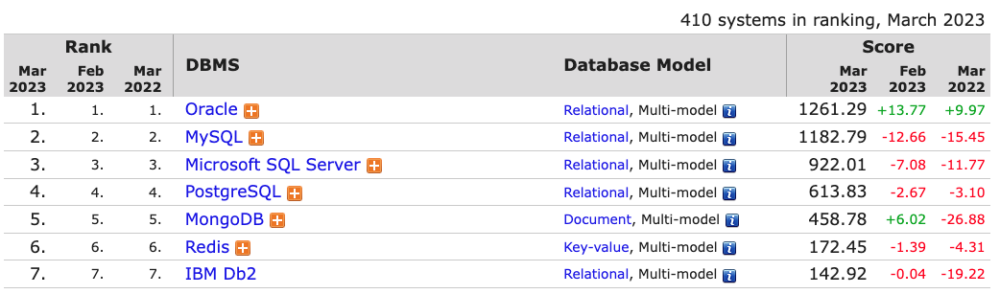
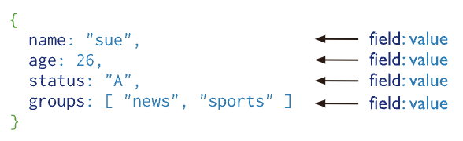

# Week 5

## Table of Contents
  - link 1
  - link 2
  - link 3
  - link 4

## Objectives
- Databases
- MongoDB
- Mongoose

## Databases

Databases let us work with large amounts of data efficiently. They make updating data easy and reliable, and they help to ensure accuracy. 
They offer security features to control access to information, and they help us avoid redundancy.

[NoSQL databases](https://www.mongodb.com/nosql-explained) are a type of database that stores data in a format other than the traditional tabular format of relational databases.

### Brief History

NoSQL databases emerged in the late 2000s as the cost of storage dramatically decreased. Gone were the days of needing to create a complex, difficult-to-manage data model in order to avoid data duplication. Developers (rather than storage) were becoming the primary cost of software development, so NoSQL databases optimized for developer productivity.

Additionally, the Agile Manifesto was rising in popularity, and software engineers were rethinking the way they developed software. They were recognizing the need to rapidly adapt to changing requirements. They needed the ability to iterate quickly and make changes throughout their software stack — all the way down to the database. NoSQL databases gave them this flexibility.

The [relational DB model](https://www.ibm.com/topics/relational-databases) is a table-based model. Each table has a fixed number of columns, and each row has a value for each column. The columns are defined in the table schema, and the rows are the data. The data is stored in a tabular format, with each row representing a single record. 

This model can be rigid and inflexible. It requires a lot of planning and forethought to create a schema that will work for all the data you want to store. It also requires a lot of work to update the schema if you need to add or remove columns.

Cloud computing also rose in popularity, and developers began using public clouds to host their applications and data. They wanted the ability to distribute data across multiple servers and regions to make their applications resilient, to scale out instead of scale up, and to intelligently geo-place their data. Some NoSQL databases like MongoDB provide these capabilities.

### NoSQL

NoSQL databases are schemaless. They store data in a format that is more flexible than the relational model. They are often referred to as “schemaless” because they don't require a schema to be defined before data is stored.
Comparing the relational model to the NoSQL model, the relational model is like a spreadsheet, and the NoSQL model is like a JSON object.

This flexibility makes NoSQL databases a good choice for storing data that is unstructured or that changes frequently.

There are many different types of NoSQL databases, and they are often categorized by the way they store data.

  - [Key-value stores](https://redis.com/nosql/key-value-databases/) store data in key-value pairs. The key is used to look up the value. The value can be any type of data, including a document. Key-value stores are often used for caching and session management **(Redis)**
  - [Document stores](https://www.mongodb.com/document-databases) store data in documents. Documents are similar to JSON objects. They are a collection of key-value pairs. Documents are stored in collections. Document stores are often used for storing unstructured data **(MongoDB)**
  - [Wide-column stores](https://bi-insider.com/posts/apache-cassandra-nosql-database/) store data in tables. Each row in the table is a key-value pair. The key is a unique identifier for the row, and the value is a collection of key-value pairs. Wide-column stores are often used for storing time series data **(Cassandra)**
  - [Graph stores](https://neo4j.com/docs/getting-started/current/get-started-with-neo4j/graph-database/) store data in a graph structure. Nodes are connected by edges. Graph stores are often used for social networks and recommendation engines **(Neo4j)**

## MongoDB

[MongoDB](https://www.mongodb.com/) is a NoSQL database that stores data in JSON-like documents and is the most popular NoSQL database. 

### Document Databases

A record in MongoDB is a document, which is a data structure composed of field and value pairs. MongoDB documents are similar to JSON objects. The values of fields may include other documents, arrays, and arrays of documents.

MongoDB stores data records as BSON documents. BSON is a binary representation of JSON documents, though it contains more data types than JSON.

The value of a field can be any of the [BSON data types](https://www.mongodb.com/docs/manual/reference/bson-types/), including other documents, arrays, and arrays of documents.

Field names in a document must be unique. Field names cannot contain the null character.

### Collections